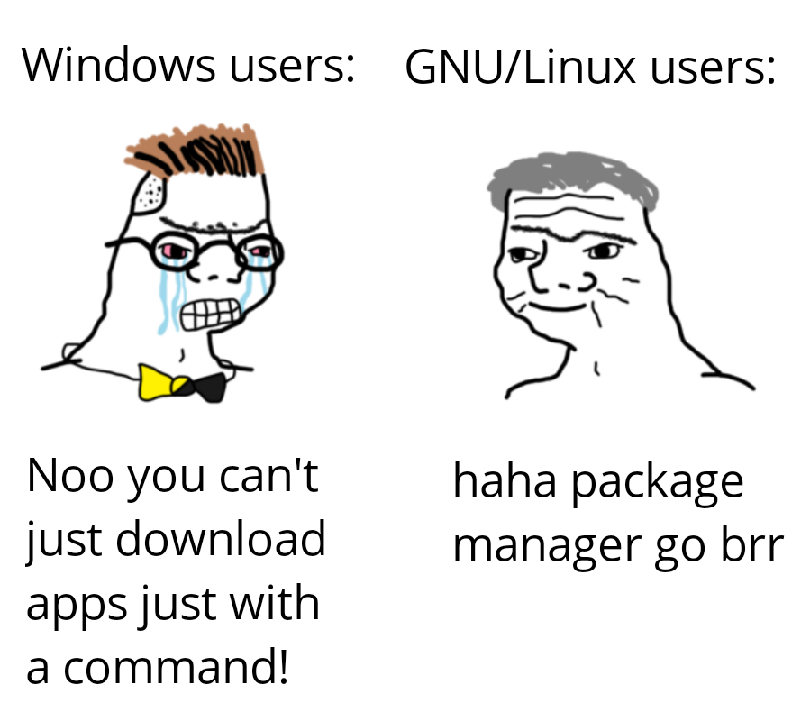
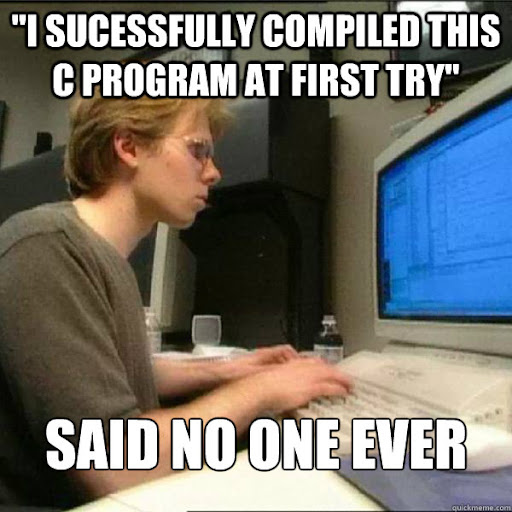

Criterion: what is it, why use it, how to use it.

## What is it ?

Criterion is a C/C++ testing framework. It's made to be as simple as it can get while still providing powerful features to make it usable in a wide range of use cases.

## Why use it ?

First because without unit tests (we will come back later on what is a unit test and what it's not) at Epitech you won't go far. Unit tests are mandatory to valid your stumper and count for your grade on **every** project.
But those rules at Epitech are here for a reason.

> Unit tests are what you are not: reliable

It might sound dumb, but you especialy  are not as reliable as you think, you will forget to test something when implementing a new feature or fixing an old bug. And depending on the project, if there is not a fail-safe mechanism to warn you when you break something the consequences can be quite literally life or death.
No need to worry during your cursus the chance you work on a nuclear plant are quite low (but never zero!), but you might fail a project because when implementing the last thing, on the last day, you broke half of the functions without noticing.
Testing is a way to ensure that a given function give the correct output, or at least the same every time. It also help to think about every edge-case where your top-of-the-line algorithm could (and will) fail.

## How to use it?

So now we know what is it, and why it's important to use such testing framework in our code, but how do we use it ?

### Installing Criterion

First we need to install criterion (because after all criterion is 'just' a C/C++ library).
It will depends on your system so pick the one that correspond to your need.

| Plateform | Command |
| ---- | ---- |
| **Ubuntu / Debian** | `apt-get install libcriterion-dev` |
| **Arch Linux** | `yay -S criterion` |
| **Nix** | `nix-env -iA ixpkgs#criterion` |
| **NixOS** | *add* `nixpkgs#criterion` *into your configuration.nix* |
| **Fedora 38** | Click [here](https://intra.epitech.eu/file/Public/technical-documentations/C/install_criterion.sh) to download a script that install criterion |
| **Windows** | Click [here](https://github.com/Snaipe/Criterion) to build it from the sources |
> *Note that to download the Fedora 38 script you need to be logged on the Epitech Intranet website*



### Using it

Take the project given in the `my_verry_interresting_project` folder. It's made to be as bare bone as it can get. The given Makefile implements the basic rule-set (all, clean, fclean, re). And here comme the interesting part: **we need to edit the Makefile.**
Because think of it, we need to compile another binary, with another list of source, it can be a mess really quickly if we don't do it well.
We can go with this by two way: either we make another Makefile for our tests, or we improve the current one. In this workshop I will show you how to improve the given Makefile, as it's my personal way of doing this, but both are valid if you follow the standards.

So let's add a new rule, per standard let's called it `unit_tests`
```Makefile
unit_tests:
	#DoSomething
```

This rule need to compile something, and thus we need the list to thing to compile.

Let's add a new list of sources and the corresponding objects.
```Makefile
TEST_SRC = empty

TEST_OBJ = $(TEST_SRC:.c=.o)
```

Finally we can wrote the line to compile those objects, let's get back to our `unit_tests` line:
```Makefile
unit_tests: $(TEST_OBJ)
	$(CC) $(TEST_OBJ) $(CFLAGS) -o unit_tests
```

And let's not forget to update our `clean` and `fclean` rules:
```Makefile
clean:
	@ rm -f $(OBJ)
	@ rm -f $(TEST_OBJ)
	@ find . -name "*.gcda" -delete -o -name "*.gcno" -delete

fclean:
	@ rm -f $(NAME)
	@ rm -f unit_tests
```

We are still missing an important part, we need to give a special set of flags to gcc to let it know that we want to compile with our criterion library and with the special magic needed to add coverage (we will come back on that later).

To do that, let's edit once again the `unit_tests` rule:
```Makefile
unit_tests: CFLAGS += -lcriterion --coverage -g3
unit_tests: $(TEST_OBJ)
	$(CC) $(TEST_OBJ) $(CFLAGS) -o unit_tests
```

Let's breakdown what those do:
* `-lcriterion` add the criterion library when we compile
* `--coverage` will tell the compiler to generate special files when running the tests (those `.gcda` or `.gcno`)
* `-g3` enable the 'debug' mode to keep tracking stuff in the binary so that a debugger could better indicate us where is the issue

But you might notice an issue, we compile our test only .. with our tests, so they can test anything! That's where we need a bit of trickery, we need to compile our test **without** our main, as Criterion add it's own, but we cannot simply remove our main.c file or our program will never compile on it's own.

That's why we need to edit a final time our Makefile, edit your Makefile so that it's the same as the snippet bellow, we will breakdown what we change just after.
```Makefile
SRC = calculator.c

TEST_SRC := $(SRC)

SRC += main.c
```
This allow use to have in `SRC` the list of all our source code with the main, and in `TEST_SRC` the same without our main, and with our tests (those will be added later).



### Writing our first test

We're getting here, after all this setup we can write our first test!
Per standard we will put our tests in the `tests` folder, for this time the folder is already created, so you just need to create a file called `my_test.c` in it.

Here is the syntax of a Criterion test:
```c
/*
** EPITECH PROJECT, 2024
** HUB-Workshop-Criterion
** File description:
** my_test.c
*/

#include <criterion/criterion.h>

Test(basic, example) {
    cr_assert_eq((1 + 1), 2);
}
```

> *Don't forget to include the criterion library!*

In the example above, I wrote a test in the `basic` group, with the name `example`.
And the test pass if `(1 + 1)` is equal to `2`;

Let's add this file to our Makefile:
```Makefile
TEST_SRC := $(SRC)
TEST_SRC += ./tests/my_test.c
```

### Write your own tests

New it's your part, write at least 4 tests for each function (add and mul).
Don't hesitate to ask questions if you don't know what/how to test.

Pass at the next section **only** if you have 8 or more tests and if they all pass.

### Every is working, and the tests passed !

Great, our code is working, our tests are reporting 100% passed, any developer would be happy in this situation.

But now come the issue, we need to implement a new function, something that divide by two a given integer. And here is the dangerous part: we didn't wrote that code, some did it for us, here is the code that is given to you
```c
int div_by_two(int a)
{
	return ((a >> 1) + 1);
}
```


*Copy and paste this snippet of code into calculator.c, no need to worry about calculator.h it's already filled with the needed prototype.*

Write 4 more functions to test if the function operate as wanted.
If it doesn't, you might want to change the implementation, maybe there is another way to divide something by 2?
Remember you **cannot** edit the main to test if the function is working.

## And voila

You now know how to use Criterion, why use it, and how to integrate it in your existing Makefile. Don't hesitate to ask questions if you need, use the remaining time to try adding tests to one of our existing project.

If you need more documentation on how to do something, you can find explained snippets in the `examples` folder, you can also search on the [Epitech wiki](https://epitech-2022-technical-documentation.readthedocs.io/en/latest/criterion.html)
